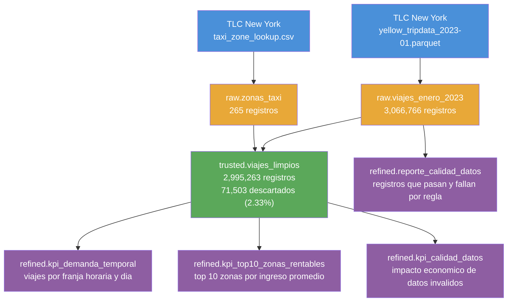

# Diagrama de Lineaje — Pipeline Taxis NYC

Muestra el flujo completo de los datos desde las fuentes originales
hasta los indicadores de negocio.

## Fuentes → Raw → Trusted → Refined

## Transformaciones aplicadas en cada capa

**Raw → sin transformaciones**
Los datos llegan tal como están en la fuente. Solo se persisten
en Delta para tener una fuente de verdad inmutable.

**Raw → Trusted**
- 5 reglas de validación aplicadas
- Join con tabla de zonas para enriquecer con barrio y zona de origen
- Renombramiento de columnas al español
- 71,503 registros descartados (2.33% del total)

**Trusted → Refined**
- Agregaciones por franja horaria y día de la semana (KPI 1)
- Ranking de zonas por ingreso promedio por viaje (KPI 2)
- Comparación de ingresos con y sin datos inválidos (KPI 3)
- Reporte formal de calidad con registros que pasan y fallan por regla
